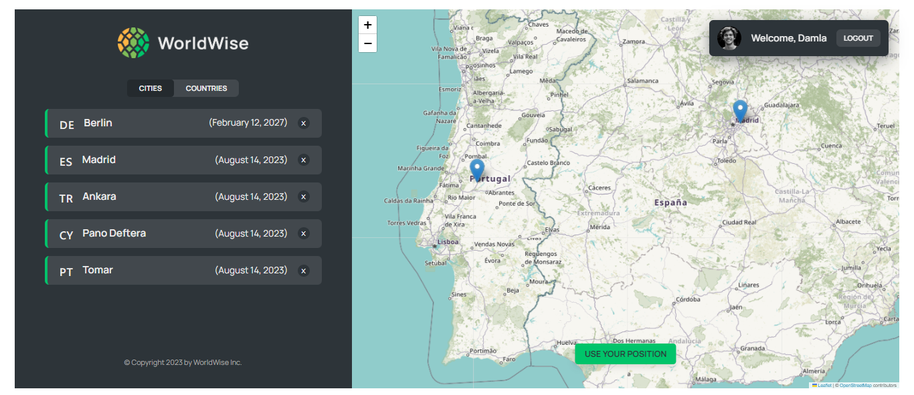

# WorldWise: Keep Track of Your Adventures

An application where you can register all the cities that you have ever traveled to.

## Table of contents

- [Overview](#overview)
  - [The app](#the-app)
  - [Screenshot](#screenshot)
  - [Built with](#built-with)
  - [Used Features](#used-features)
- [Author](#author)

## Overview

### The app

Users should be able to:

- View the optimal layout depending on their device's screen size
- Initially, they can see a welcome, product and pricing page.
- They can see a list of cities they added and also the countries which automatically come from the cities.
- They can delete a city from the list.
- They can see their current position from the map (using geolocation api).
- They can see the cities in the list marked on the map.
- They can add a city by clicking on the map, and add a comment.

### Screenshot

### Built with

- React.JS
- module CSS
- custom hooks
- Context API
- ESLint
- Vite
- Leaflet

### Used Features
- useState
- useEffect
- useSearchParams
- createContext
- useReducer
- useCallback
- REST API

## Author

- LinkedIn - [Damla Kara](https://www.linkedin.com/in/damla-kara-348081232/)